# 🏥 Diagnostic Center Management System

A C# desktop application (Windows Forms) with SQL Server database integration, built as a course project for **CSC2210: Object Oriented Programming 2** at American International University–Bangladesh (AIUB).

The system digitizes the day-to-day operations of a diagnostic center — patient registration, staff management, test scheduling, billing, and record maintenance — replacing error-prone manual paperwork with a fast, role-based desktop application.

---

## 📑 Table of Contents

- [Overview](#-overview)
- [Team](#-team)
- [Features](#-features)
  - [Admin](#admin)
  - [Receptionist](#receptionist)
- [Tech Stack](#-tech-stack)
- [Database Design](#-database-design)
  - [ER Diagram](#er-diagram)
  - [Schema Summary](#schema-summary)
  - [SQL Setup](#sql-setup)
- [Screenshots](#-screenshots)
- [Course Info](#-course-info)

---

## 📌 Overview

A diagnostic center plays a vital role in modern healthcare by providing patients with accurate medical testing and timely results. To ensure smooth operations, such centers need an efficient system to handle patient registration, staff management, test scheduling, billing, and record maintenance. Traditionally, these tasks were managed manually, which often led to delays, errors, and mismanagement of data.

The **Diagnostic Center Management System** overcomes these challenges by offering a digital solution that automates day-to-day operations:

- Administrators manage staff and resources effectively.
- Receptionists handle patient details and billing quickly.
- Patients receive faster and more reliable service.
- Tests, accessories, and payment information stay organized and easily accessible.

By implementing this system, the diagnostic center reduces paperwork, improves accuracy, and enhances the overall quality of service delivery — giving patients quicker registration and transparent billing, and giving staff a smoother, better-coordinated workflow.

---

## 👥 Team

**Group 12 — Section N**

| # | Name | Student ID |
|---|------|-----------|
| 1| Shohag Rana | 23-54897-3 |
| 2 | Mubassir Islam Jimel | 23-54918-3 |
| 3 | Samiha Sultana | 23-54895-3 |


**Supervised by:** Md. Hasibul Hasan

---

## ✨ Features

The system supports two roles, each with a distinct set of permissions.

### Admin

- Full **CRUD** (Create, Read, Update, Delete) access on all system entities — Tests, Accessories, Receptionists, and Admins.
- Manage user accounts (Receptionists and other Admins) with complete control.
- Update or modify Test and Accessory details, including price, quantity, and associated disease information.
- View billing information across the system.
- Holds the highest authority in the system, with unrestricted access to all features and data.

### Receptionist

- Second-tier role, subordinate to Admin.
- Add, update, and manage patient details — registration, personal info, and contact details.
- Generate bills for patients, including payment status, total amount, and remarks.
- Update their own personal information.
- Limited access compared to Admins — cannot directly modify system-level entities like Tests or Accessories.

---

## 🛠 Tech Stack

| Layer | Technology |
|---|---|
| Language | C# |
| UI | Windows Forms (GUI-based desktop application) |
| Database | Microsoft SQL Server |
| Data Access | ADO.NET / SQL queries |

---

## 🗄 Database Design

### ER Diagram

<p align="center">
  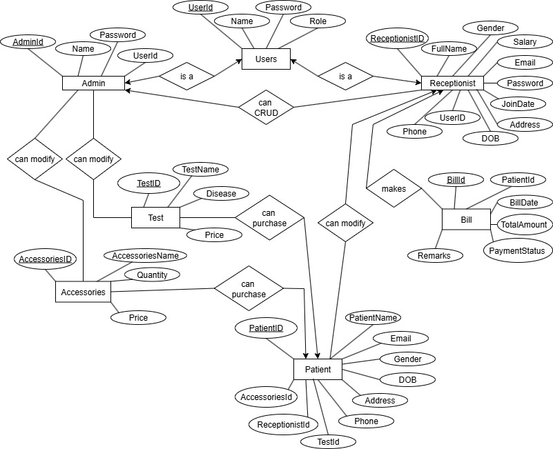
</p>

### Schema Summary

The database (`NewDiagnostic`) consists of the following tables:

| Table | Purpose | Key Columns |
|---|---|---|
| `Users` | Login credentials and role (Admin / Receptionist) | `UserId` (PK), `Role` |
| `Admin` | Admin profile, linked to `Users` | `AdminId` (PK), `UserId` (FK → Users) |
| `Receptionist` | Receptionist profile, linked to `Users` | `ReceptionistId` (PK), `ReceptionistId` (FK → Users) |
| `Patient` | Patient records, linked to test, accessory, and receptionist | `PatientId` (PK), `AccessoriesId`, `ReceptionistId`, `TestId` (FKs) |
| `Test` | Diagnostic tests offered and their prices | `TestId` (PK) |
| `Accessories` | Medical accessories/supplies inventory | `AccessoriesId` (PK) |
| `Bill` | Patient billing records | `BillId` (PK), `PatientId` (FK) |
| `BillDetails` | Line items for each bill (tests / accessories) | `BillDetailsId` (PK), `BillId`, `TestId`, `AccessoriesId` (FKs) |

**Relationships:**
- `Admin.UserId` → `Users.UserId`
- `Receptionist.ReceptionistId` → `Users.UserId`
- `Patient.AccessoriesId` → `Accessories.AccessoriesId`
- `Patient.ReceptionistId` → `Receptionist.ReceptionistId`
- `Patient.TestId` → `Test.TestId`
- `BillDetails.BillId` → `Bill.BillId`
- `BillDetails.TestId` → `Test.TestId`
- `BillDetails.AccessoriesId` → `Accessories.AccessoriesId`

### SQL Setup

The full database creation script — table definitions, constraints, foreign keys, and seed data — is available in [`database/NewDiagnostic.sql`](database/NewDiagnostic.sql).

<details>
<summary>Click to preview table structure</summary>

```sql
USE [NewDiagnostic]
GO

CREATE TABLE [dbo].[Users](
    [UserId] [varchar](20) NOT NULL,
    [Name] [varchar](100) NOT NULL,
    [Password] [varchar](100) NOT NULL,
    [Role] [varchar](100) NOT NULL,
    CONSTRAINT [PK_Users_1788CC4CDD471C49] PRIMARY KEY CLUSTERED ([UserId] ASC)
)
GO

CREATE TABLE [dbo].[Patient](
    [PatientId] [varchar](20) NOT NULL,
    [PatientName] [varchar](100) NOT NULL,
    [Phone] [varchar](20) NULL,
    [Email] [varchar](100) NULL,
    [Gender] [varchar](10) NULL,
    [DateOfBirth] [date] NULL,
    [Address] [varchar](255) NULL,
    [AccessoriesId] [varchar](20) NULL,
    [ReceptionistId] [varchar](20) NULL,
    [TestId] [varchar](20) NULL,
    PRIMARY KEY CLUSTERED ([PatientId] ASC)
)
GO

CREATE TABLE [dbo].[Bill](
    [BillId] [varchar](20) NOT NULL,
    [PatientId] [varchar](20) NOT NULL,
    [BillDate] [date] NULL,
    [TotalAmount] [decimal](10, 2) NULL,
    [PaymentStatus] [varchar](20) NULL,
    CONSTRAINT [PK_Bill_11F2FC6A852784E5] PRIMARY KEY CLUSTERED ([BillId] ASC)
)
GO
```

*(See the full script in the linked `.sql` file for all tables, foreign keys, and seed data.)*

</details>

---

## 📸 Screenshots

### Login Panel
<p align="center">
  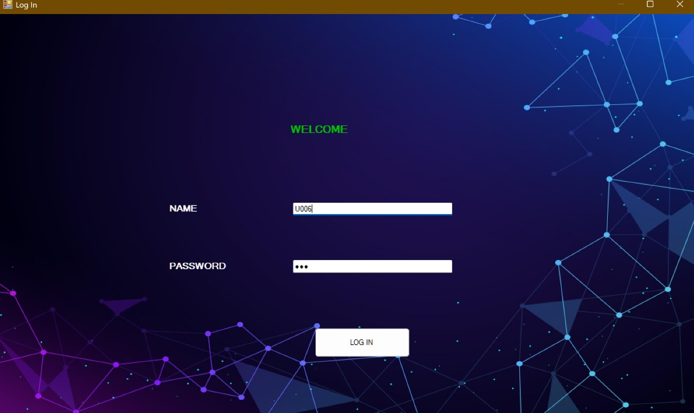
</p>

### Admin Panel
<p align="center">
  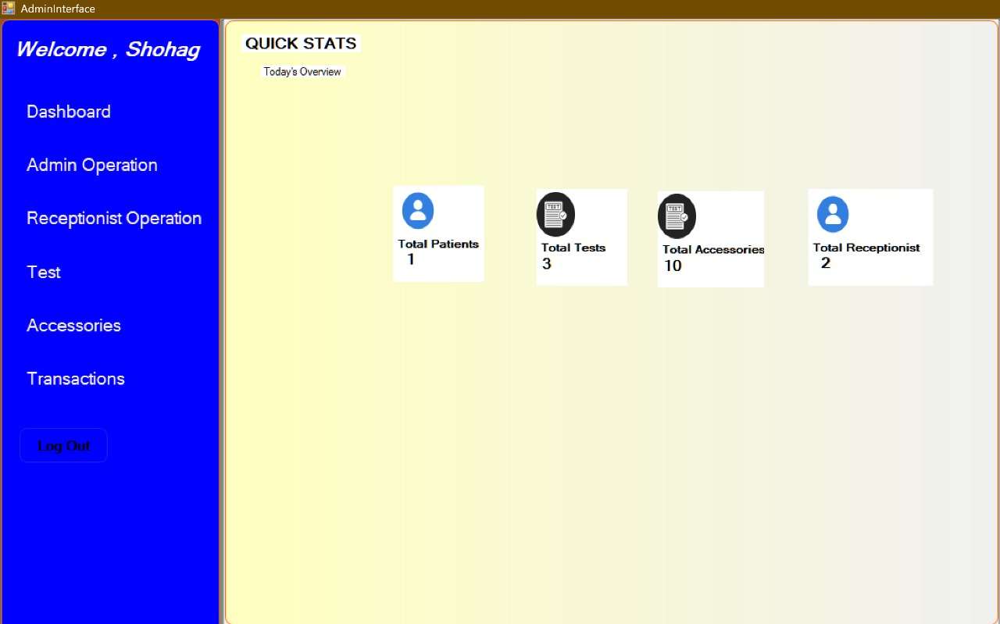
</p>

### Admin Operations
<p align="center">
  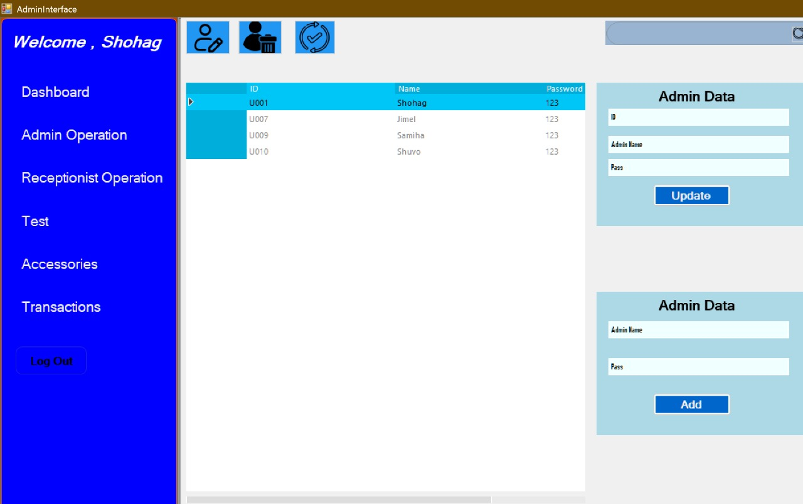
</p>

### Receptionist Operations
<p align="center">
  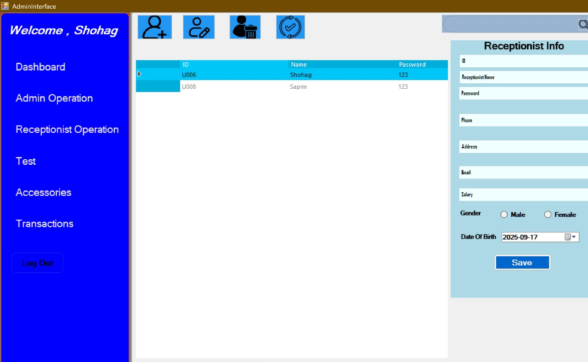
</p>

### Test Management
<p align="center">
  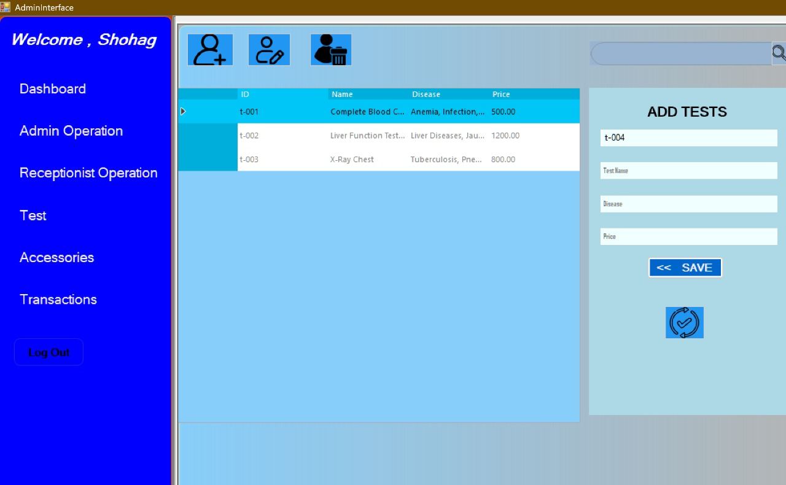
</p>

### Accessories Management
<p align="center">
  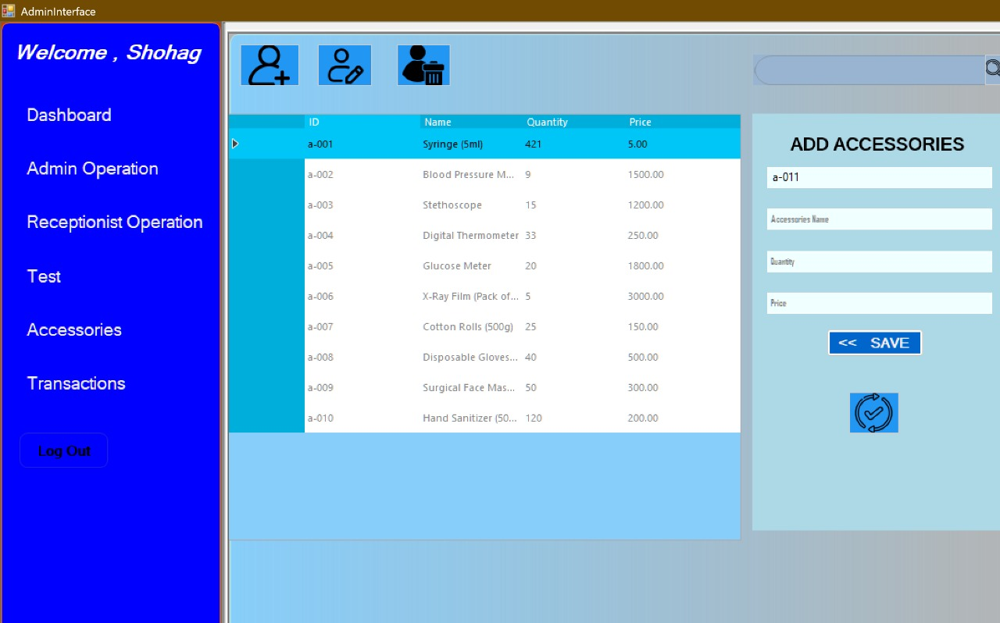
</p>

### Transactions
<p align="center">
  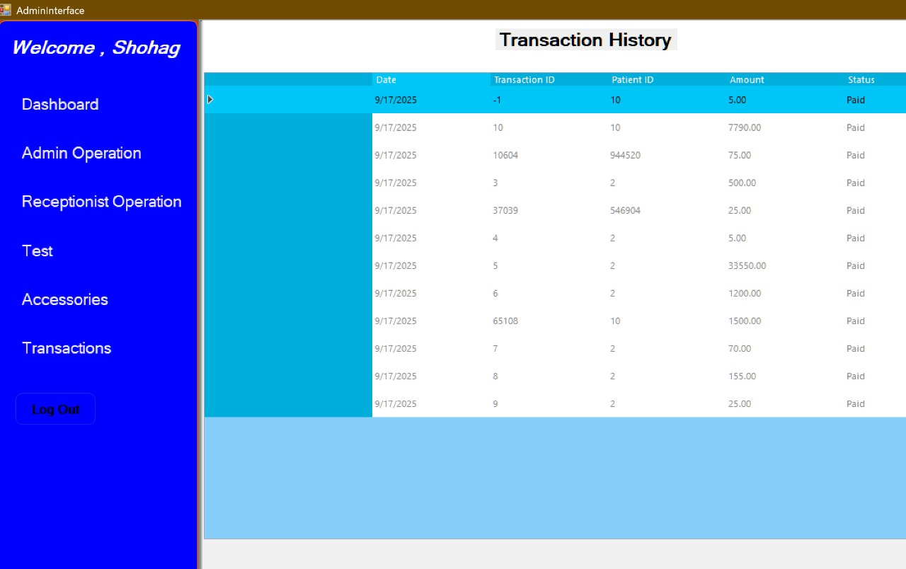
</p>

### Receptionist Dashboard
<p align="center">
  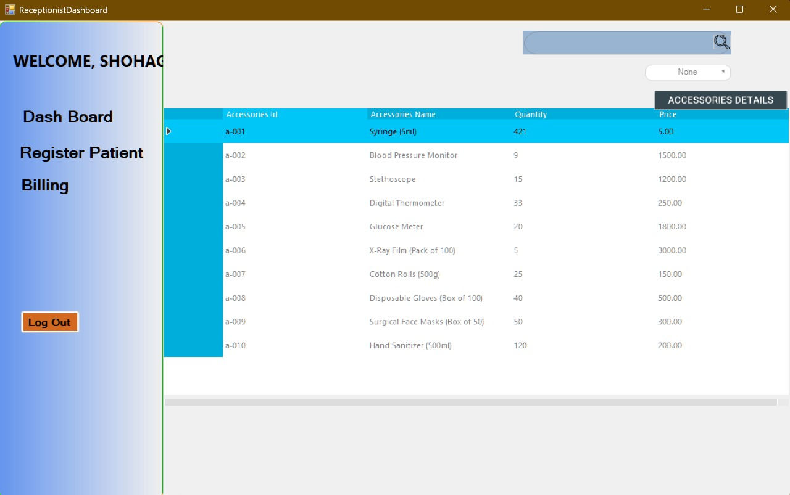
</p>

### Patient Registration
<p align="center">
  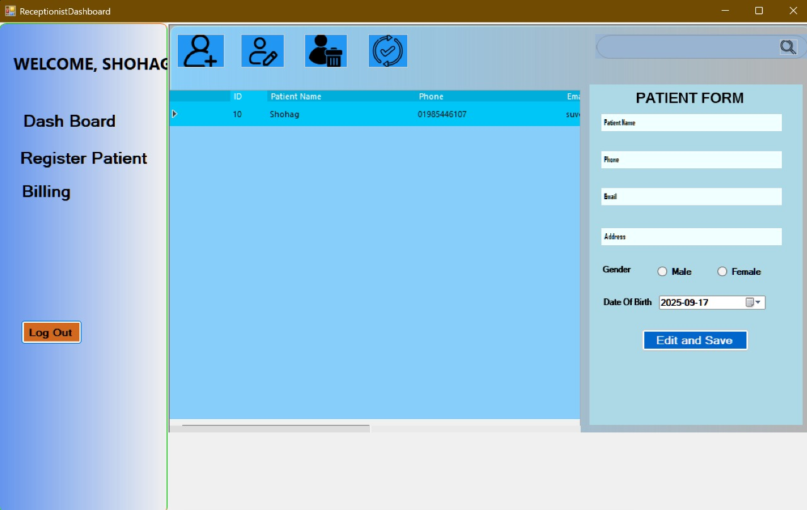
</p>

### Billing
<p align="center">
  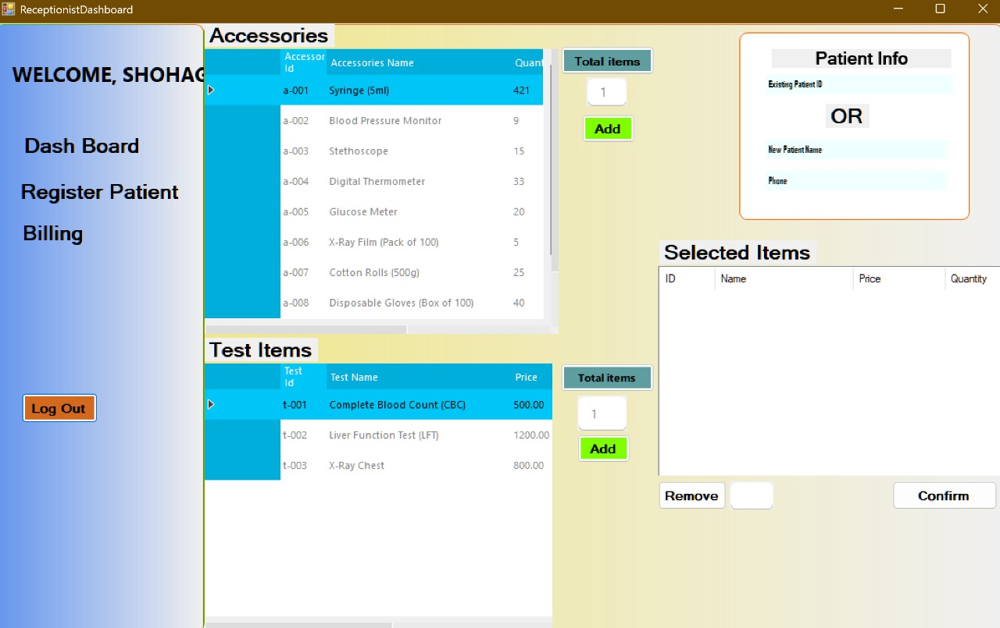
</p>

### Confirm Billing
<p align="center">
  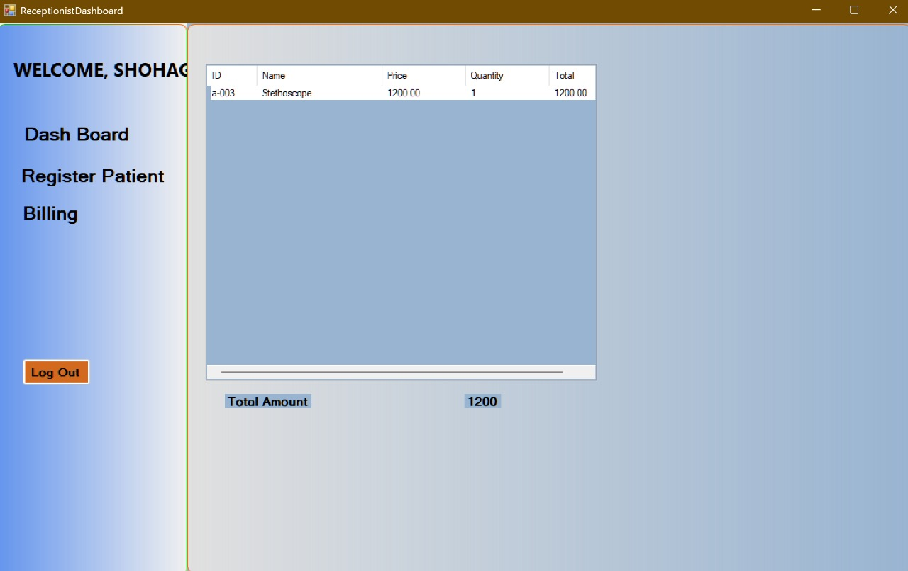
</p>

---

## 🎓 Course Info

- **Course:** CSC2210 — Object Oriented Programming 2
- **Institution:** American International University–Bangladesh (AIUB)
- **Department:** Computer Science, Faculty of Science and Technology
- **Term:** Summer 2024–2025
- **Group:** 12 (Section N)
- **Supervisor:** Md. Hasibul Hasan

---

<p align="center"><i>Built as an academic project for AIUB CSC2210.</i></p>